# Get Started

项目地址:  https://github.com/skydownacai/NeuralNetworkAndDeepLearning-Midterm

# 一.  实验1 Resnet18

## I.  训练样本数据增强可视化

这部分可以通过执行`visulization_train_sample.py` 实现

### 1. 原始样本

训练样本1: 

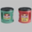

训练样本2: 

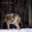

训练样本3: 

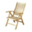

### 2. cutout

训练样本1: 

训练样本2: 

训练样本3: 

### 3. Mixup

超参数: alpha = 0.5

训练样本1: 

训练样本2: 

训练样本3: 

### 4. Cutmix

超参数: alpha = 0.5

训练样本1: 

训练样本2: 

训练样本3: 

## II.  四种方法在Cifar100数据集上的对比

对于四种方法.我们使用的超参数如下

**Baseline:**

| 参数名称              | 取值   |
| --------------------- | ------ |
| 学习率                | 0.01   |
| 优化器                | SGD    |
| Batch Size            | 128    |
| Train Epoch Num       | 10     |
| cutout边框尺寸        | 8      |
| mixup 与cutmix的alpha | 0.2    |
| 损失函数              | 交叉熵 |

### 1. 训练损失 Train Loss

### 2. 测试集精准度 Test Accuracy

# 实验二. 目标检测实现之Faster R-CNN与YOLOv3

## 数据介绍 
该项目使用VOC数据集，此数据集是目标检测中常用数据，其中以2007和2012的数据最为常用，本项目就选用了2007和2012的数据作为训练集，包含共16551张图片及其中目标物体的类别和bounding box位置；测试集为2007年数据中给出的4952张测试图片，两者划分方式是由官方网站指定给出的。
## 网络结构
### Faster R-CNN
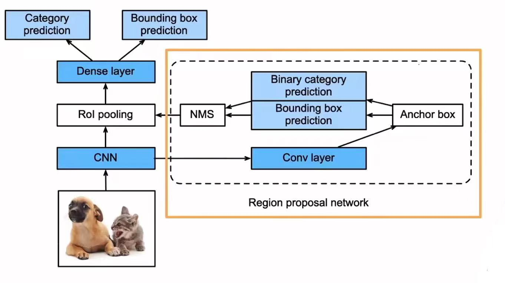
其中黄线标注出来的网络即RPN网络，意在主网络进行预测之前通过CNN网络通过非极大值抑制生成Proposal box，再将选出来的Proposal box映射到主网络CNN的输出的特征图上，接下来进入RoI池化层对每个Proposal box抽取特征，再进入全链接层进行预测。其中主网络中第一步用于提取特征的CNN用的是ResNet50模块。

### YOLOv3：
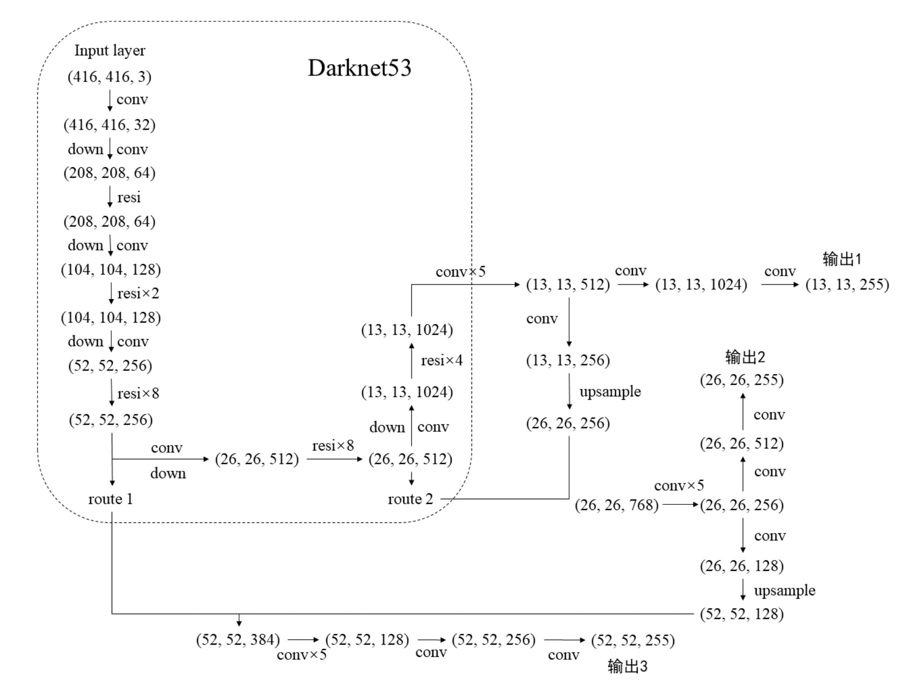
其中虚线框内的过程即YOLOv3的骨干网络：Darknet53。输入部分为一个416*416的3通道张量，经过Darknet53网络，再经过Yoloblock得到13*13的256通道特征图分别经过3*3卷积层、1*1卷积之后生成输出1；同时该特征图也会经过1*1卷积层和上采样层（即将小尺寸特征图通过临近插值法等方法，生成大尺寸图像)，再与Darknet53网络的中间层的输出进行组合，经过如图示的网络生成输出2，其中间层输出的26*26的256通道特征图也会与Darknet53网络中另一中间层输出结果组合，再经过图中网络生成输出3。

## 各项超参数及优化器
### Faster R-CNN
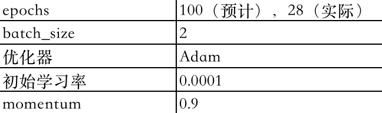
### YOLOv3
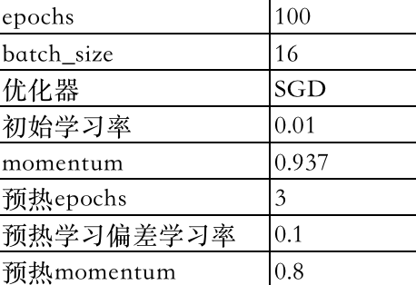
## 评价指标
本项目选择mAP（mean Average Precision，即对每个目标类别的PR曲线的面积的平均值）作为测试的评价指标。
## Loss function

### Faster R-CNN
$L\left(\left\{p_{i}\right\},\left\{t_{i}\right\}\right) =\frac{1}{N_{c l s}} \sum_{i} L_{c l s}\left(p_{i}, p_{i}^{*}\right)
+\lambda \frac{1}{N_{r e g}} \sum_{i} p_{i}^{*} L_{r e g}\left(t_{i}, t_{i}^{*}\right)$
其中第一部分是2个类别的分类损失（有无对象），第二部分是边界框的回归损失，即只有当有物体时才存在损失。
### YOLOv3
YOLOv3有三个检测层，每一层对应一个loss，这3类loss包括：
1.边界框loss（box_loss），即模型所得到的预测中心坐标和高度、宽度与真实值之间的误差所对应的损失。
2.置信度loss（obj_loss），即每个边界框预测值的置信度得分相关的损失。
3.分类loss（cls_loss），即对边界框的分类误差对应的损失。
其公式如下所示：
$\operatorname{box\_loss}(\text { object }) =\lambda_{\text {coord }} \sum_{i=0}^{K \times K} \sum_{j=0}^{M} I_{i j}^{o b j}\left(2-w_{i} \times h_{i}\right)\left[\left(x_{i}-\hat{x}_{i}\right)^{2}+\left(y_{i}-\hat{y}_{i}\right)^{2}\right]+\lambda_{\text {coord }} \sum_{i=0}^{K \times K} \sum_{j=0}^{M} I_{i j}^{o b j}\left(2-w_{i} \times h_{i}\right)\left[\left(w_{i}-\hat{w}_{i}\right)^{2}+\left(h_{i}-\hat{h}_{i}\right)^{2}\right]. \\
\\
\operatorname{obj\_loss}(\text { object }) =-\sum_{i=0}^{K \times K} \sum_{j=0}^{M} I_{i j}^{o b j}\left[\hat{C}_{i} \log \left(C_{i}\right)+\left(1-\hat{C}_{i}\right) \log \left(1-C_{i}\right)\right]-
 \lambda_{\text {noobj }} \sum_{i=0}^{K \times K} \sum_{j=0}^{M} I_{i j}^{\text {noobj }}\left[\hat{C}_{i} \log \left(C_{i}\right)+\left(1-\hat{C}_{i}\right) \log \left(1-C_{i}\right)\right].\\
 \\
 \operatorname{cls\_loss}(\text { object }) =-\sum_{i=0}^{K \times K} I_{i j}^{o b j} \sum_{c \in c l a s s}\left[\hat{p}_{i}(c) \log \left(p_{i}(c)\right)+\left(1-\hat{p}_{i}(c)\right) \log \left(1-p_{i}(c)\right)\right].$
## 运行结果
### Faster R-CNN：训练、测试loss曲线以及测试mAP曲线
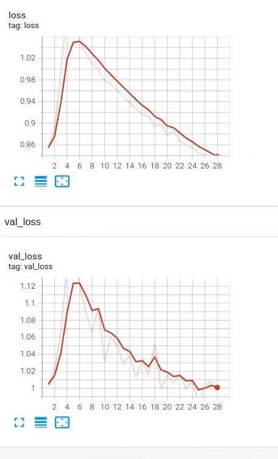
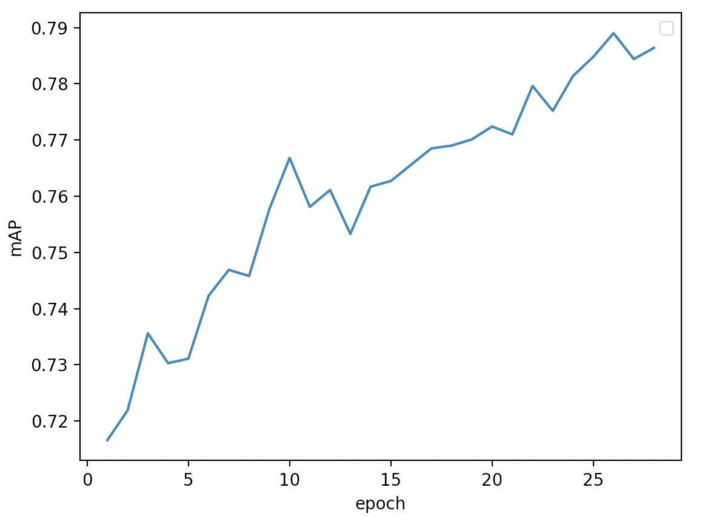

### YOLOv3：训练、测试的3部分loss曲线及测试mAP曲线（含precison和recall曲线）
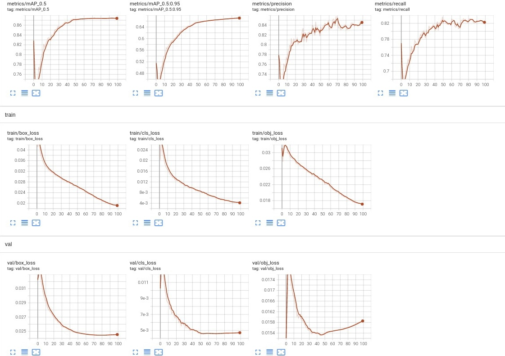
注：mAP_0.5表示IoU阈值设置为0.5时的mAP曲线；mAP_0.5:0.95表示IoU阈值分别设置为0.5,0.55,...,0.95时的平均mAP曲线。

### Faster R-CNN：proposal box可视化
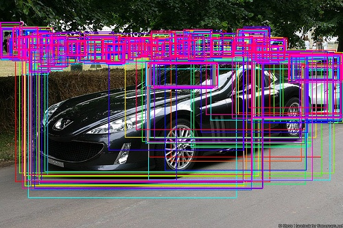
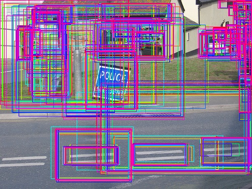
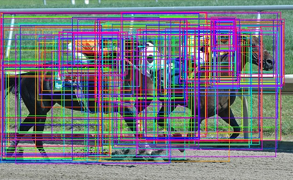
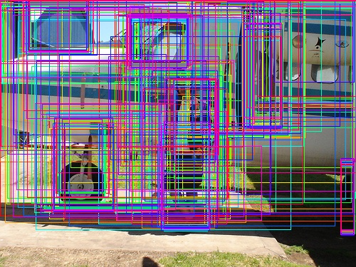

### Faster R-CNN：自选图片检测结果
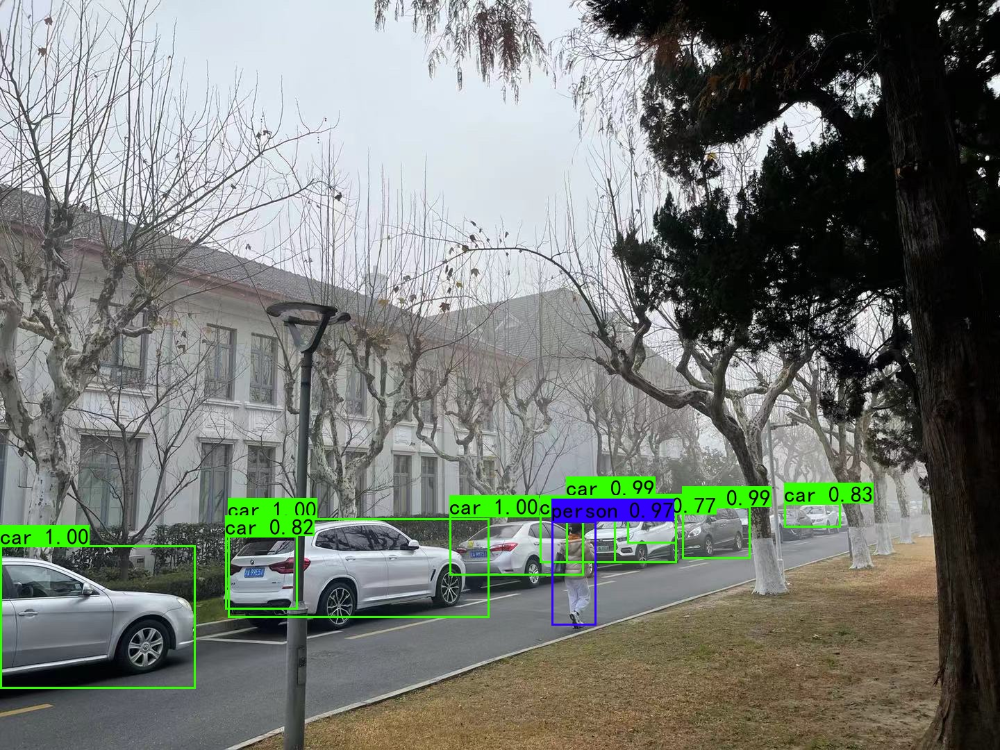
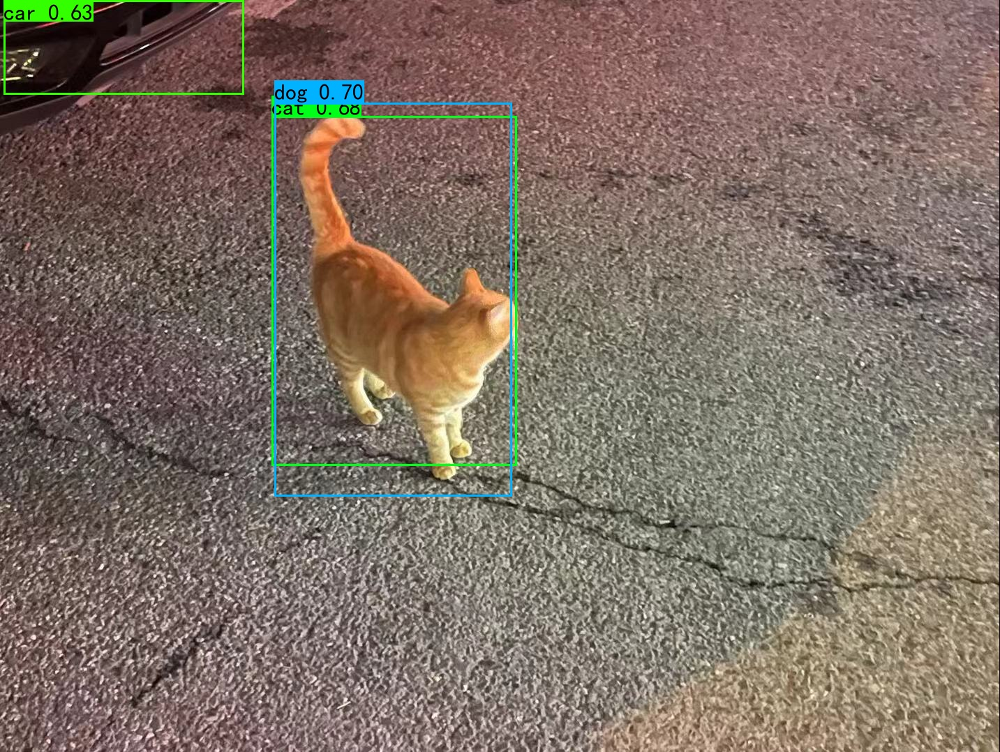
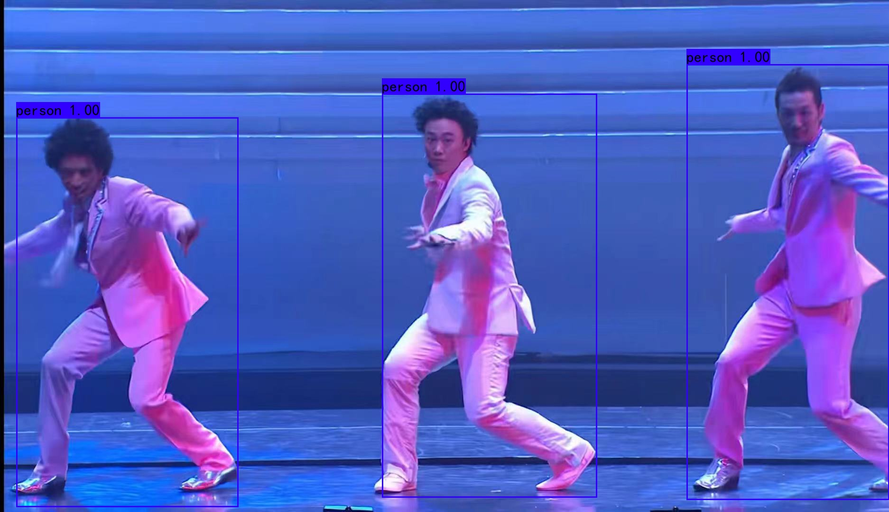

### YOLOv3：自选图片检测结果
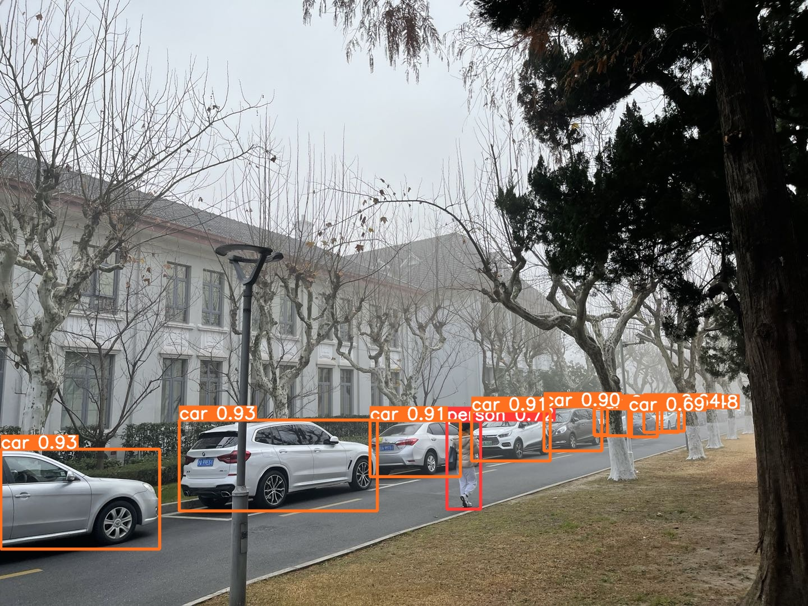
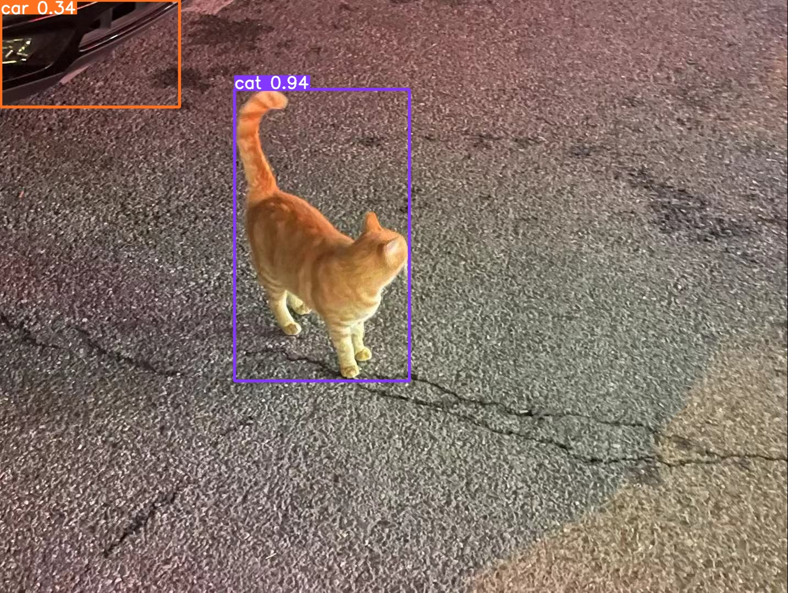
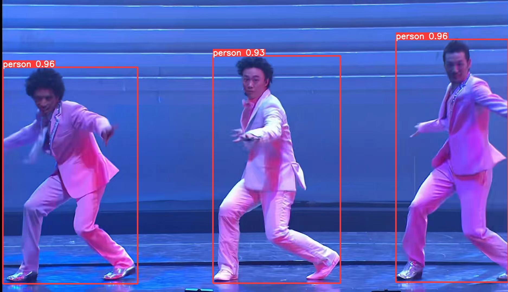
注：Faster R-CNN效果不如YOLOv3的一部分原因可能在于训练时间限制了迭代次数（只训练了28个epoch)。

